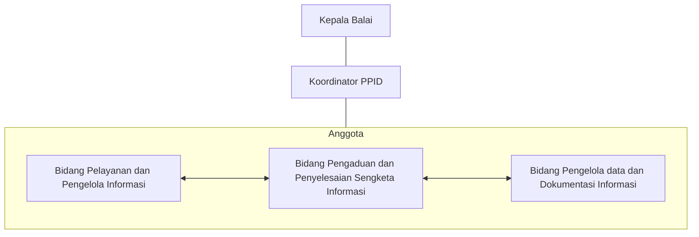

PPID UPT adalah pejabat administrator/pejabat pengawas yang membidangi kehumasan di UPT kemendikdasmen

## Struktur Organisasi PPID

## SK Tim PPID

<Card horizontal title="SK PPID 2025 s.d 2029" icon="file-invoice"  href="https://drive.google.com/file/d/1EFHovV_5qnO8r7Xtxz85EyXbbsIjhsG2/view?usp=sharing">
    SK PPID KGTK Gorontalo Periode 2025 s.d 2029
  </Card>

<Card horizontal title="SK PPID 2022 s.d 2024" icon="file-invoice"  href="https://drive.google.com/file/d/1EFHovV_5qnO8r7Xtxz85EyXbbsIjhsG2/view?usp=sharing">
    SK PPID BGP Gorontalo Periode 2022 s.d 2024
  </Card>