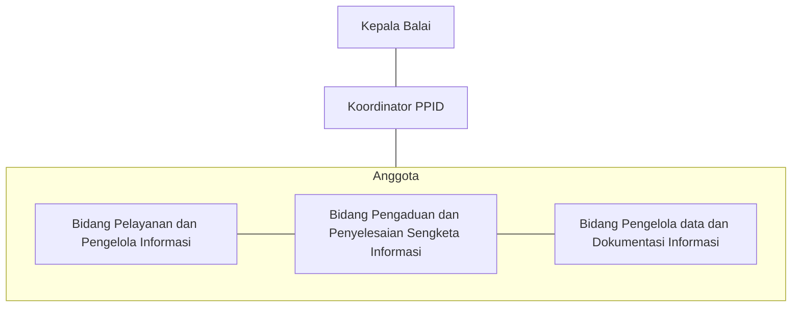

PPID UPT adalah pejabat administrator/pejabat pengawas yang membidangi kehumasan di UPT Kemendikbudristek

## Struktur Organisasi PPID

## SK Tim PPID

<Card horizontal title="SK PPID 2022 s.d 2024" icon="file-invoice"  color="#E50914">
    SK PPID BGP Gorontalo Periode 2022 s.d 2024
  </Card>